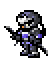

# 忍者   
[PvPアクション](https://jp.finalfantasyxiv.com/jobguide/ninja/#pvp)  

# 雑評
縮地を使いこなせたら強い、そうでないなら弱い。という感じ。  
器用貧乏となるか、万能となるかはプレイヤー次第といったところ。  

どちらかというと少人数戦のほうが性能を生かしやすいわね。  
制圧戦は最強格のジョブ。AとCアラに絶対一人は欲しいぐらい。  
シールロックや砕氷の場合は、集団が散りやすいから、群れからはぐれたプレイヤーを狙ってく運用ならそこそこ強いわね。  
オンサルは火遁マンになりがち。  
正直、劫火滅却・土遁・天誅しかできないなら別のジョブでいいと思うわよ。  
Dot ばらまくなら学者でいいし、単体の敵をどうにかしたいならモンクのほうがいいわね。  

## 強み
一番の強みと言われれば、HP50%未満の敵に対して確定KOを取れるLBの天誅かしらね。   
そのほかにも、単体のバースト能力、優秀なCC、防衛能力、追跡・逃走能力と売りが多い。  

フロントラインにおいては被ダメージ補正と戦意高揚のせいもあって、１対１で敵を倒す、というのが結構難しい。  
倒せたしても、かなりの時間がかかってしまう。  
忍者は敵のHPを51%削れた時点でKOを狙える点が強みですわね。
敵のHP51%を削るのも、レンジやキャスター当たりに狙いを絞れば容易。  

単体のKO能力のほかには、状況に応じて動き方を変えられるところ。  
三印自在派生を氷遁乱流や月影雷獣牙などにすれば単体火力特化、命水や風遁などにすれば耐久特化などに切り替えられるわね。  
これのおかげで攻めるとき、守るときなどに役割を変えられるところが大きな強み。  

あとは命水が強いわね。  
DPSでは唯一、プレイヤー対象でヒールを撒ける点は明確な強み。  
射程は悪くないし、着弾時の回復量も大きい。（10000くらいあるんじゃないかしら。戦意で回復量も増える・・・わよね？）  

## 弱み
縮地を使いこなせないと強みをを生かしきれないところ。  
範囲のバーストが苦手というところ。  

範囲アクションは劫火滅却と土遁があるけれど、バースト火力としてみるにはちょっとしょっぱいわね。  
劫火滅却は威力だけで見れば、トータル20000なのだけれどDotだからバーストとしては見れないわね。  
土遁はどちらかというとCCがメインだし、火力だけで見ると弱め。  
ということで集団戦開幕時にできることが非常に少ないのが弱み。  

# 運用
リザルトで高い与ダメージを目指すより、KO数を増やすような運用があってると思うわね。  
とにかく単体を倒すことを念頭に置いて、三印自在を使っていくといいと思うわね。  

## バースト
### 単体
とりあえずポイント。上から重要度昇順。  

1. 天誅は高い威力のアクションに続けてアビリティのように使う。  
   天誅は確定KOの判定が入るまでちょっとだけラグがあるんですわよね。  
   だから、敵の快気が間に合わないように、高い火力のアクションの後にアビリティのように使うと大抵の場合は倒しきれるわね。  
1. 縮地を接近技として使わない。  
   月影雷獣牙でいいわよ。  
   追撃、逃げのために縮地が残っているのが大事。  
1. 敵から逃げるときは、防御中に縮地を使う。  
   これをすると安全に逃げやすいわね。  
   縮地は万能でもなく、縮地の判定中にCCや引き寄せにあたると隠れるが解除されて容易につかまってしまう。  
   防御中に縮地を使うことで、極力縮地に対して攻撃を当てられないようにするということ。  
1. 三印自在は効果時間があるわよ。   
   つまり、忍術は任意で使うタイミングをずらせるということ。  
   例えば、三印自在の効果時間ギリギリで忍術を使えば、戦闘中に３回忍術を使うことができる可能性があるわね。     
1. 月影雷獣牙を使ったら風魔手裏剣を使いましょう。  
   月影雷獣牙は、1度使ったあと2回目を使うまでに猶予時間があるわよ。  
   そのうえで、三印自在の忍術判定は終わっているから、風魔手裏剣を使えるのが強み。（氷遁に化けない）  
   せっかく2回スタンを与えられるのだから、ちゃんと2回スタンさせましょう。  
   とりあえずは1回目の雷獣牙を使ったら2回、風魔手裏剣を挟むようにすると、敵の浄化をケアしつつ2回目のスタンを決められるわね。  
1. 戦闘前に分身を使う。  
   火力が上がるし、防衛力も上がる。使い得。  
1. 無理にぶんどるスタートしなくてよい。  
   おすすめは月影雷獣牙の後でいいと思うわね。  
   極力、徒歩で距離を詰めないこと。  

#### ひとりで倒す その１
回りを見て、敵が３～４人だったり、多数でも帰れそうなときに使う。 
とりあえず縮地は戦闘中の状況によって使い分けられるように最後に使う。  

1. 三印自在  
1. 氷遁乱流  
   1. 三印自在  
1. 月影雷獣牙  
   1. 分身  
   1. ぶんどる  
1. 風魔手裏剣: 9000  
1. 風魔手裏剣: 9000  
1. 月影雷獣牙: 8000  
   1. 縮地  
1. 終撃  
   1. 星遁天誅（LB）  

#### ひとりで倒す その２
回りを見て、敵が３～４人だったり、多数でも帰れそうなときに使う。 
帰り道に縮地を使う必要がなさそうであれば縮地スタートはあり。  

1. 分身  
1. 縮地  
1. 終撃  
   1. ぶんどる  
   1. 三印自在  
1. 月影雷獣牙  
1. 風魔手裏剣  
1. 風魔手裏剣  
1. 月影雷獣牙  
   1. 三印自在  
1. 氷遁乱流  
   1. 星遁天誅（LB）  

#### ひとりで倒す その３
天誅からスタートする場合。そのうえで帰りたいとき。  

1. 三印自在
1. 風遁の術 or 命水  
   1. 分身
1. 星遁天誅（LB）  
   1. 防御
1. 縮地
   1. 浄化

途中、天誅をチェイン出来そうならする。  
でも基本的に防御は最初の1回に使えばいいとおもうわよ。
何よりも最初の天誅に対してカウンターが入りやすいから、カウンターに防御を合わせる感じ。  
敵がカウンターにバーストを合わせればあとはほとんど怖くないし、味方からフォーカスが外れるから次の天誅待機もできるわね。  

### 範囲
あえて書くほどの内容がないわね・・・。  
劫火滅却を撒くとか、土遁置いて手裏剣投げるとかそういう話しかない。  
劫火滅却は着弾時に8000のダメージが入るから、単体でもまぁそこまで悪くないのだけれど。  

# マップ別ガイド
わたくしは一応、クリコン（S1、S3クリスタル）もフロントラインも忍者結構使っている忍者メインのプレイヤーなのだけれど、  
正直、制圧以外は忍者が忍者として独自の役割があるかといわれるとあまりないわね。  
とはいえ素のスペックは高いから、持て余すほどでもないとは思うわよ。  

## 外縁遺跡群（制圧戦）
そのうち書くけれど、クリコンみたいな感じ。  

### 立ち位置
集団から外れたところ。  

### 役割
敵の数をとにかく減らす、もしくはトリッキーに立ち回って敵を翻弄すること。  
制圧戦は敵の数を減らせば有利に直結しやすいから、数を確実に減らしやすい忍者の役割は大きいわよ。  

ここら辺がトリッキーに立ち回るということついては、
敵の集団と味方の集団の位置を常に意識して、回復を撒いたり敵の後衛をかき乱すという感じ。  
主に後者になるわね。  
敵の後衛をつぶしつつ、狙われ始めたらタンク的な立ち位置になり、縮地で味方集団に戻ってくること。  
もしくは、味方集団から外れた位置に逃げることで敵集団を分断させたりするのもいいわね。  

## シールロック（争奪戦）
戦意高いプレイヤーを確実に仕留める役割。  
それ以外は暇。劫火滅却打つぐらいしかやることないわね。  

### 立ち位置
どこでもええわよ。

### 役割
戦意高いプレイヤーを確実に仕留めるだけ。  

## フィールド・オブ・グローリー（砕氷戦）
戦意高いプレイヤーを確実に仕留める役割。  
それ以外は暇。劫火滅却打つぐらいしかやることないわね。  

### 立ち位置
どこでもええわよ。

### 役割
戦意高いプレイヤーを確実に仕留めるだけ。  

## オンサル・ハカイル（終節戦）
戦意高いプレイヤーを確実に仕留める役割。  
それ以外は暇。劫火滅却打つぐらいしかやることないわね。  

### 立ち位置
どこでもええわよ。

### 役割
戦意高いプレイヤーを確実に仕留めるだけ。  

