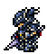

# 竜騎士   
[PvPアクション](https://jp.finalfantasyxiv.com/jobguide/dragoon/#pvp)  

# 雑評
正直、強い以外に言うことがないわね。  
初心者にはお勧めしないけれど、慣れてきたあたりでジョブに困ったら竜さん使っておけばまぁええわよ。  

## 強み
超高火力、高耐久、高離脱能力。  
とまぁいろいろ揃っとるわね。  
一番の強みは、対象不可状態になってから数秒後に大ダメージをばらまくLBかしらね。  
まぁこれがとにかく強いんですわよね。  
そのうえで、竜さんは自己バフを使うことでフロントラインの被ダメージ減少補正をモノともしないところも強み。  

## 弱み
近接ジョブの立ち回りを必要とすること。  
そのぐらいしか言いようがないのだけれど、強いて挙げればCCがないところ。  
※今の竜騎士の性能に加えて、CCなんて付けたらフロントラインさらに壊れちゃうけれど。  

# 運用
## バースト
### 単体
### 範囲
# マップ別ガイド
## 外縁遺跡群（制圧戦）
### 立ち位置
### 役割
## シールロック（争奪戦）
### 立ち位置
### 役割
## フィールド・オブ・グローリー（砕氷戦）
### 立ち位置
### 役割
## オンサル・ハカイル（終節戦）
### 立ち位置
### 役割

