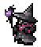

# 黒魔導士   
雑感。
[PvPアクション](https://jp.finalfantasyxiv.com/jobguide/blackmage/#pvp)  

# 雑評
## 強み
比較的LBのたまりが速く、LB中の火力が非常に高い。  
LB中はバースト力（瞬間的な火力）と継続火力が両立しているのが強み。  

また、火力の高さの割に安全圏で攻撃できたり、優秀な移動スキルを持つ。  
CCで唯一ダメージを持つ睡眠を持っていたりする。  
（スタン・ノックバック・魅了・カッパ・スロウ・凍結・沈黙・・・、たぶんダメージのあるCCは他にないわよね？）  

## 弱み
自己防衛能力が低く、柔らかい。  
敵を倒す以外に役割がない。  
非LB中は詠唱が必要なので、工夫しない限り火力が低い。  

# 運用
## ファイア系統とブリザガ系統
わたくしはとりあえずファイアをよく使う。  
ファイア系統は敵に与えたデバフスタックに応じて、ヒートショック使用時に威力3000のDotの持続時間が伸びる。
ブリザガ系統は敵に与えたデバフスタックに応じて、ヒートショック使用時にヘビィ、バインド、氷結が付与される。  

フロントラインの場合、たいていのジョブがCCを持っているし人が多いからデバフは割と過剰に付与されるし、  
黒魔も睡眠を持っているのでブリザガ系統のデバフを有効活用しようとすると難しい。  
ブリザガ系統は敵の浄化を見てから足止めに使うのが有用な使い方だと思うわよ。  

対してファイア系統の場合は威力が低いもののDotという点が有用。  
快気を吐かせるための牽制にも使えるし、防御を張られた時にもHPを削ってくれる。  
集団戦を仕掛けるときはこっちがいいと思うわね。  
戦意が高くなってくれば、4500まで威力が伸びるし悪くない数値だと思うわよ。  

## エーテリアルステップ
敵、味方、自分自身を対象にして移動するアクション。  
ついでに魔法のキャストをインスタント化してくれる迅速魔がつく。  

### <me> マクロ
迅速付与を目的とした自分自身を対象にするマクロ。  
このマクロと、移動・迅速付与用の素のアクションを二つセットしておくと良いわね。  
```
/micon エーテリアルステップ pvpaction
/pvpac エーテリアルステップ <me>
```

なんでこれが必要かというと。  
迅速付与したいだけで敵に飛んでしまうのはリスクだし、かといって味方に飛びつくのも攻撃までにラグがある。  
敵のタゲを外して使用することもできるけど、タゲしなおす必要があるから、割と誤爆しやすくて危ない。  
`<me>`マクロは敵のタゲを外さないまま迅速だけ付与できるから、上記のような悩みを解決してくれるわよ。  

### 迅速魔の使い道
迅速魔は何に使ってもまぁいいと思うけれど、わたくしは非LB中のフレアか、バーストに使っているわね。  
バーストについては後述。  
非LB中のフレアについては、無理のない距離感と戦況で使うこと。  
ファイアが詠唱できない状況なら、迅速で殴りに行ける状況ではないから、殴れそうなときに使うこと。  

### 運用方法
エーテリアルステップは、攻めと逃げ両方で使う。  
２スタックの内１スタックは逃げ用にキープしておくといいわね。  
それに加えて、味方の中から、前にでなくても戦えるようなレンジやヒラをフォーカスターゲットしておくといいわよ。  
とっさに逃げたいとき、素早くタゲを切り替えられて逃げやすくなるわね。  

素の状態でエーテリアルステップをすると、移動の最初から終わりにかけて敵CCに引っかかりやすいから注意すること。  
ステップで距離を稼げても、CCが当たれば逃げ切れないことがあるから、できれば防御と合わせること。  

防御を張った状態で味方にステップすると、敵のCCに引っかかりづらいからおすすめ。  
防御を張った際に利用するときは、防御の効果時間が切れるタイミングで使うよりも、防御の効果時間の継続中に使ったほうがお得。  
敵がある程度慣れたプレイヤーだった場合、防御バフを見てリソース調整してくるから、防御の効果時間終了時に合わせてCCをかぶせてくることがあるわよ。  
そうなると黒魔は逃げられないから、あえて防御の途中でキャンセルするようにステップを使うと、敵の目論見から外れて逃げ出すことができる。かも。  

この逃げ手段を利用して、以下のように動くとバーストを攻撃目的に使いやすくなるわよ。  
1. （任意で）ナイトウィング
1. 敵に対してステップ
1. バースト
1. 防御
1. 味方にステップ

当然、ステップする味方の位置を確認しないとできないけれど、LBがない期間でもダメージが出せるし、暗黒のソルトアースとかに合わせられるのが強み。  
LBを持っていればあえてやる必要はないけれど、瞬間火力ならバーストのほうが優秀だし、バーストを腐らせることもないからアクション１つ分継続火力を上げられるわね。  
LBのフレアとかファウルは、バーストを使った後にでも使えばいいんじゃないかしら。  
ちなみにわたくしはこの動きを黒魔ドッヂボールと呼んでいる。  

## バースト
これアクション名ではなく、短期間に火力の高いスキルを詰め込んだコンボのこと。  
これはクリコンとかやってる人の記事見たほうがええんじゃないかしら。  
おおむね以下のコンボを使い分けている。
数値見てコンボやってるわけでなく、なんか倒しやすいコンボこれですわねって覚えたやつを逆算しているだけ。  
ジョブの被ダメージマイナス補正や戦意高揚の与ダメージプラス補正も入ってくるから数値そのままのダメージにはならんけれど、まぁ参考程度に。  
ファイア系Dotのダメージは瞬間のみ記載。完走ダメージではない。  


追記：
下にコンボを色々書いてあるのだけれど、  
最近は正直、単体・範囲に限らず フレア > ヒートショック即打ち が一番強いんじゃないかと思い始めてきたわよ。  
理由は単純に瞬間火力が高いから。それだけ。  

### 単体
#### その1（4GCD）
総威力 50000 or 58000  
1. ファイア: 4000  
   1. （任意）ナイトウィング: 8000  
1. ファイジャ: 6000  
1. フレア: 12000(8000+4000)  
   1. エーテリアルステップ: 0
1. バースト: 16000
   1. ヒートショック: 12000(9000+3000)  

#### その2（4GCD）
その1のLBあり版。  
大抵のレンジ、キャスターは倒せる。  

総威力 64000 or 72000
1. フレア: 12000(8000+4000)  
   1. （任意）ナイトウィング: 8000  
1. フレア: 12000(8000+4000)  
1. フレア: 12000(8000+4000)  
   1. エーテリアルステップ: 0  
1. バースト: 16000  
   1. ヒートショック: 12000(9000+3000)  

威力は変わらず、バーストをファイルに置き換えた版。  
1. フレア: 12000(8000+4000)  
   1. （任意）ナイトウィング: 8000  
1. フレア: 12000(8000+4000)  
1. フレア: 12000(8000+4000)  
1. ファウル: 16000  
   1. ヒートショック: 12000(9000+3000)  

#### その3（3GCD）
総威力 40000 or 48000  
1. （任意）ナイトウィング: 8000  
1. ファイア: 4000  
1. パラドックス: 8000  
   1. エーテリアルステップ: 0  
1. バースト: 16000  
   1. ヒートショック: 12000(9000+3000)  

敵が防御張ってるときに使うことが多い。パラドックスまでが防御に吸われてもいいところ。  
ファイアの代わりにブリザガを使う場合はちょっと火力落ちるけれど、敵を捕まえたいときとかに。  

#### その4（3GCD）
その3のLBあり版。補足情報も一緒。  
総威力 48000 or 56000  
1. （任意）ナイトウィング: 8000  
1. フレア: 12000(8000+4000)  
1. パラドックス: 8000  
   1. エーテリアルステップ: 0  
1. バースト: 16000  
   1. ヒートショック: 12000(9000+3000)  

ファウル置き換え版。  
1. （任意）ナイトウィング: 8000  
1. フレア: 12000(8000+4000)  
1. パラドックス: 8000  
1. ファウル: 16000  
   1. ヒートショック: 12000(9000+3000)  

### 範囲
正直、範囲攻撃に関しては何を打つかよりもどこに打つかっていう着弾地点のほうが大事。  
ダメージ数値の高いアクション系はどれをとっても範囲が狭いからうまく5mに入れる相手を選ぶこと。  
ダメージ自体は1GCD~2GCD間に20000以上のダメージ値出せてれば十分。  

#### その1（1GCD）
黒魔ドッヂボール。  
LBない時でも16000。  

1. エーテリアルステップ  
1. バースト  
   1. 防御  
   1. エーテリアルステップ  

#### その2（1GCD）
書くほどでもない。  
16000ダメ。  
1. ファウル  

#### その3（?GCD）
ダメージは14000ほど。完走
1. フレア: 8000  
   1. ヒートショック: 6000(3000+3000)  

# 基本的な立ち回り
立ち位置は敵との距離感が20m以上25m以下である場所かつ、敵のCCきつめなジョブから遠い立ち位置あたりで粘って戦う。  
役割としては、敵集団の快気を減らす、味方のバーストに合わせて敵を殲滅する、という２つ。  

## 非LB時
非LB中は火力が大幅に下がるから、フレアをできるだけ多く打つこと。  
ステップマクロを使って迅速を使いつつ、できるだけフレア/ブリザジャを回していく。  
上達してきたら、黒魔ドッヂボールも入れる。  

書くこと自体はそんぐらいなんですけれど、これが結構難しい。  
ステップは１つ逃げに残しておかないとすぐに死んでしまうから、  
ファイア/ファイジャあたりを詠唱で当てられて、かつ逃げやすい距離感を保つこと。  
まぁこれがむずいんですけれど。  

## LB時
LBのチャージ速度が速いから、戦闘ごとに使うのが大事。  
じゃあいつ使うのって話だけれど、敵との距離によって使い分けているわね。  

戦闘予定地点から遠い場合は、LBを使わずにまずはバーストでドッヂボールする。  
ちょっとだけ安全地帯まで下がったらLBを使って追撃するという感じ。  

戦闘予定地点から近い場合は、LBを先に使っておいてバーストでドッヂボールする。  
安全地帯まで下がってHPに余裕があれば即フレアかファウル。  

LBは使用時に硬直が1秒強発生してしまうかｒ、集団戦のバーストの開始時に攻撃に参加できなくならないようにしましょう。  
味方が仕掛けたタイミングから1GCDも経ってしまえば、敵は防御を張ってしまうからダメージが通りづらくなってしまう。  
できるだけ無防備な状態の敵に、強い攻撃を当てられるようにするには味方の仕掛けるタイミングに合わせて火力を出すことが大事。  
遅れないようにしましょう。  

# マップ別ガイド
## 外縁遺跡群（制圧戦）
### 立ち位置
前衛のちょっとだけ後ろ。
ほかのマップに比べて8vs8の少人数戦が起こりやすいから、調子に乗って前に出るとあっさり倒されてしまう。  
敵のタンクや近接を倒すか、長い射程を生かして柔らかい敵の後衛を範囲で焼いてラインを下げさせたり倒したりする。  


もしくは味方集団から少し外れたところに立って、味方集団と敵集団との直線状に立たないようにする。  
黒魔は直線系のアクションがないから、直線状にいる必要がなく遊撃的な立ち位置を取れるのが強み。  

制圧戦のマップには、直線の通路がいくつかあり、この通路上で戦闘することが多い。  
戦士や白魔などの直線系のアクションが相対的に強くて、それにに巻き込まれないような立ち位置が肝。  
敵が仕掛け時に、後衛のカウンターめがけて攻撃することで敵のラインを強引に分断してしまうのもあり。  


### 役割
敵を倒す。以上。  

## シールロック（争奪戦）
### 立ち位置
前衛ぎみ。一人だけ突出していなければつかまっても防御ステップで逃げられるため。  
あとは集団戦に確実に参加するため。  

敵集団と味方集団の直線状にいないこと。  
これは制圧の画像と似たような感じ。  

### 役割
敵を倒す。以上。  

## フィールド・オブ・グローリー（砕氷戦）
### 立ち位置
前衛ぎみ。一人だけ突出していなければつかまっても防御ステップで逃げられるため。  
あとは集団戦に確実に参加するため。  

敵集団と味方集団の直線状にいないこと。  
これは制圧の画像と似たような感じ。  

### 役割
敵を倒す。以上。  
ちなみに、実は氷を解かすのは得意なほう。  

## オンサル・ハカイル（終節戦）
### 立ち位置
平地では前衛ぎみ。一人だけ突出していなければつかまっても防御ステップで逃げられるため。  
あとは集団戦に確実に参加するため。  

敵集団と味方集団の直線状にいないこと。  
これは制圧の画像と似たような感じ。  

中央の台においては、橋と橋の間の台座沿い、自陣にちょっとだけ寄ったところ。  
暗黒や戦士などは橋と台のつなぎ目に一直線に来ることが多いから、範囲に巻き込まれずらい場所に位置どる。  
範囲に巻き込まれそうになったら、快気を連打しつつすぐに台から降りること。  
同じように、敵のCCにつかまってかつ敵が接近していたら浄化＋台から降りつつ快気を連打。  

戦士のブロート（引き寄せ）につかまった場合は、防御不可やモンクが来ないことを祈りつつ防御をすぐに張ること。  
無事に生きてたら、防御中に味方を探してステップすれば生き残りやすいわよ。  

### 役割
敵を倒す。以上、ではないわね。珍しい。  
中央の戦闘においては、ちょっとだけ敵を倒す以外にも役割があるわね。  

中央の台には３拠点それぞれに近い橋があるのだけれど、中央での戦いはその橋から少し頭を出したり引っ込めたりして、集団でのバーストの牽制をし合うことが多いわよ。  
この牽制中に敵の足止め目的で、LBぶっぱができるわね。  
例えば、自陣営がバーストを仕掛けたい対象ではないほうのグランドカンパニーをフレア連打で押さえつけて割り込みを抑え込んだり、  
戦意高揚が平均的に高いグランドカンパニーの快気を減らすことで、その敵からの仕掛けを遅延させたりするのが目的。  

遠隔かつ高火力の範囲を継続的に打ち続けられる黒魔ならではの役割だと思うわよ。  

