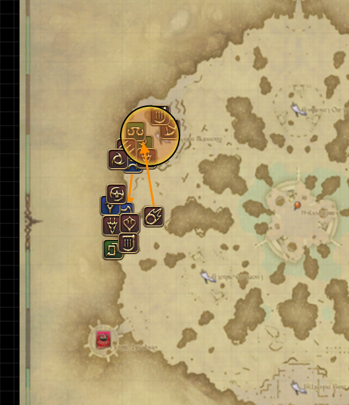
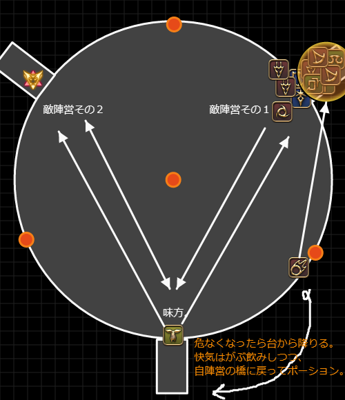

# 黒魔導士
雑感。
[PvPアクション](https://jp.finalfantasyxiv.com/jobguide/blackmage/#pvp)  

  

# 雑評
## 強み
LB中の火力が非常に高く、そのうえで比較的LBのたまりが速い。  
火力の高さの割に安全圏で攻撃できる。  
優秀な移動スキルを持つ。  
CCで唯一ダメージを持つ睡眠を持っている。  

## 弱み
柔らかい。敵を倒す以外役割がない。  
LBじゃない通常状態の時は詠唱しなければいけないのでダメージを出そうとすると難しい。  

## 運用
### ファイア系統とブリザガ系統
わたくしはとりあえずファイアをよく使う。  
ファイア系統は敵に与えたデバフスタックに応じて、ヒートショック使用時に威力3000のDotの持続時間が伸びる。
ブリザガ系統は敵に与えたデバフスタックに応じて、ヒートショック使用時にヘビィ、バインド、氷結が付与される。  

フロントラインの場合、たいていのジョブがCCを持っているし人が多いからデバフは割と過剰に付与されるし、  
黒魔も睡眠を持っているのでブリザガ系統のデバフを有効活用しようとすると難しい。  
ブリザガ系統は敵の浄化を見てから足止めに使うのが有用な使い方だと思うわよ。  

対してファイア系統の場合は威力が低いもののDotという点が有用。  
快気を吐かせるための牽制にも使えるし、防御を張られた時にもHPを削ってくれる。  
集団戦を仕掛けるときはこっちがいいと思うわね。  
戦意が高くなってくれば、4500まで威力が伸びるし悪くない数値だと思うわよ。  

### エーテリアルステップ
自分自身を対象にするマクロと、普通のアクションを二つセットしておくと良いわね。  
これは迅速魔付与を目的とした、自分自身を対象としてステップするマクロ。  
```
/micon エーテリアルステップ pvpaction
/pvpac エーテリアルステップ <me>
```

迅速付与したいだけで敵に飛んでしまうのはリスクだし、  
かといって味方に飛びつくのもラグがあるし、  
敵のタゲを外して使用するのもタゲしなおす必要があるから、`<me>`マクロは結構有用。  
ちなみに迅速魔は何に使ってもまぁいいと思うけれど、わたくしはフレアに使っているわね。  
ファイア詠唱できない状況なら無理に迅速で殴りに行く必要はないと思うわよ。

エーテリアルステップは、攻めと逃げ両方で使えるから、２スタックの内１スタックは逃げるようにキープしておくといいわね。  
比較的前にでなくてもいいレンジやヒラをフォーカスターゲットしておくと素早くタゲを切り替えられて逃げやすくなるわね。  

ちなみに、素の状態でエーテリアルステップをするとCCに引っかかりやすく、距離を稼げても逃げ切れないことがあるからできれば防御と合わせること。  
防御を張った状態で味方にステップすると、CCに引っかかりづらいからおすすめ。  

この逃げ手段を利用して、以下のように動くとバーストを攻撃目的に使いやすくなるわよ。  
1. （任意で）ナイトウィング
1. 敵に対してステップ
1. バースト
1. 防御
1. 味方にステップ

当然ステップする味方の位置を確認しないとできないけれど、LBがない期間でもダメージが出せるし暗黒のソルトアースとかに合わせられるのが強み。  
LBを持っていればあえてやる必要はないけれど、瞬間火力ならバーストのほうが優秀。  
LBはバーストを使った後にでも使えばいいんじゃないかしら。  

ちなみにわたくしはこの動きを黒魔ドッヂボールと呼んでいる。  

### バースト
これアクション名ではなく、短期間に火力の高いスキルを詰め込んだコンボのこと。  
これはクリコンとかやってる人の記事見たほうがええんじゃないかしら。  
おおむね以下のコンボを使い分けている。
数値見てコンボやってるわけでなく、なんか倒しやすいコンボこれですわねって覚えたやつを逆算しているだけ。  
ジョブの被ダメージマイナス補正や戦意高揚の与ダメージプラス補正も入ってくるから数値そのままのダメージにはならんけれど、まぁ参考程度に。  
ファイア系Dotのダメージは瞬間のみ記載。完走ダメージではない。  

正直、範囲攻撃に関しては何を打つかよりもどこに打つかっていう着弾地点のほうが大事。  
ダメージ数値の高いアクション系はどれをとっても範囲が狭いからうまく5mに入れる相手を選ぶこと。  
ダメージ自体は1GCD~2GCD間に20000以上のダメージ値出せてれば十分。  

#### 単体その1（4GCD）
総威力 50000 or 58000  
1. ファイア: 4000  
   1. （任意）ナイトウィング: 8000  
1. ファイジャ: 6000  
1. フレア: 12000(8000+4000)  
   1. エーテリアルステップ: 0
1. バースト: 16000
   1. ヒートショック: 12000(9000+3000)  

#### 単体その2（4GCD）
その1のLBあり版。  
大抵のレンジ、キャスターは倒せる。  

総威力 64000 or 72000
1. フレア: 12000(8000+4000)  
   1. （任意）ナイトウィング: 8000  
1. フレア: 12000(8000+4000)  
1. フレア: 12000(8000+4000)  
   1. エーテリアルステップ: 0  
1. バースト: 16000  
   1. ヒートショック: 12000(9000+3000)  

威力は変わらず、バーストをファイルに置き換えた版。  
1. フレア: 12000(8000+4000)  
   1. （任意）ナイトウィング: 8000  
1. フレア: 12000(8000+4000)  
1. フレア: 12000(8000+4000)  
1. ファウル: 16000  
   1. ヒートショック: 12000(9000+3000)  

#### 単体その3（3GCD）
総威力 40000 or 48000  
1. （任意）ナイトウィング: 8000  
1. ファイア: 4000  
1. パラドックス: 8000  
   1. エーテリアルステップ: 0  
1. バースト: 16000  
   1. ヒートショック: 12000(9000+3000)  

敵が防御張ってるときに使うことが多い。パラドックスまでが防御に吸われてもいいところ。  
ファイアの代わりにブリザガを使う場合はちょっと火力落ちるけれど、敵を捕まえたいときとかに。  

#### 単体その4（3GCD）
その3のLBあり版。補足情報も一緒。  
総威力 48000 or 56000  
1. （任意）ナイトウィング: 8000  
1. フレア: 12000(8000+4000)  
1. パラドックス: 8000  
   1. エーテリアルステップ: 0  
1. バースト: 16000  
   1. ヒートショック: 12000(9000+3000)  

ファウル置き換え版。  
1. （任意）ナイトウィング: 8000  
1. フレア: 12000(8000+4000)  
1. パラドックス: 8000  
1. ファウル: 16000  
   1. ヒートショック: 12000(9000+3000)  

#### 範囲その1（1GCD）
黒魔ドッヂボール。  
LBない時でも16000。  

1. エーテリアルステップ  
1. バースト  
   1. 防御  
   1. エーテリアルステップ  

#### 範囲その2（1GCD）
書くほどでもない。  
16000ダメ。  
1. ファウル  

#### 範囲その3（?GCD）
ダメージは14000ほど。完走
1. フレア: 8000  
   1. ヒートショック: 6000(3000+3000)  

### 非LB時
後述のステップマクロを使って迅速を使いつつ、できるだけフレア/ブリザジャを回していく。  
あとは黒魔ドッヂボールする。  
書くこと自体はそんぐらいなんですけれど、これが結構難しい。  
ステップは１つ逃げに残しておかないとすぐに死んでしまうから、  
ファイア/ファイジャあたりを詠唱で当てられて、かつ逃げやすい距離感を保つのが難しい。  
おおむね敵との距離感が20m当たりであること、敵のCCきつめなジョブから遠い立ち位置あたりで粘る。  

### LBの使い時
LBのチャージ速度が速いから、戦闘ごとに使うのが大事。  
じゃあいつ使うのって話だけれど、敵との距離によって使い分けている。  

戦闘予定地点から遠い場合は、LBを使わずにまずはバーストでドッヂボールする。  
ちょっとだけ安全地帯まで下がったらLBを使って追撃する。  

戦闘予定地点から近い場合は、LBを使っておいてバーストでドッヂボールする。  
安全地帯まで下がってHPに余裕があれば即フレア。  

LBは使用時に硬直が1秒強発生してしまうので、集団戦のバーストの開始時に攻撃に参加できないことを避ける。  
仕掛けたときから1GCDもあれば、敵は防御を張ってしまうので、とにかく無防備な状態で強い攻撃を当てられるかが大事。  


## 外縁遺跡群（制圧戦）
### 立ち位置
前衛のちょっとだけ後ろ。  
ほかのマップに比べて8vs8の少人数戦が起こりやすいから、調子に乗って前に出るとあっさり倒されてしまう。  
敵のタンクや近接を倒したり、長い射程を生かして柔らかい敵の後衛を範囲で焼いてラインを下げさせたり倒したり。  
味方集団と敵集団との直線状に立たないのも大事。  
黒魔は直線系のアクションがないから、直線状にいる必要がなく遊撃的な立ち位置を取れるのが制圧戦での強み。  
制圧戦は、マップにほぼ直線の通路があり、この通路上で戦闘することが多い。  

直線系のアクションを持っている戦士や白魔あたりに巻き込まれないような立ち位置が肝。  
敵の仕掛け時に後衛にカウンターを仕掛けてラインを強引に下げてしまうのもあり。  



### 役割
敵を倒す。以上。  

## シールロック（争奪戦）
### 立ち位置
前衛ぎみ。一人だけ突出していなければつかまっても防御ステップで逃げられるため。  
あとは集団戦に確実に参加するため。  

敵集団と味方集団の直線状にいないこと。  
これは制圧の画像と似たような感じ。  

### 役割
敵を倒す。以上。  

## フィールド・オブ・グローリー（砕氷戦）
### 立ち位置
前衛ぎみ。一人だけ突出していなければつかまっても防御ステップで逃げられるため。  
あとは集団戦に確実に参加するため。  

敵集団と味方集団の直線状にいないこと。  
これは制圧の画像と似たような感じ。  

### 役割
敵を倒す。以上。  

## オンサル・ハカイル（終節戦）
### 立ち位置
平地では前衛ぎみ。一人だけ突出していなければつかまっても防御ステップで逃げられるため。  
あとは集団戦に確実に参加するため。  

敵集団と味方集団の直線状にいないこと。  
これは制圧の画像と似たような感じ。  

中央の台においては、橋と橋の間の台座沿い、自陣にちょっとだけ寄ったところ。  
暗黒や戦士などは橋と台のつなぎ目に一直線に来ることが多いから、範囲に巻き込まれずらい場所に位置を取る。  
範囲に巻き込まれそうになったら快気連打しつつすぐに台から降りること。  
同じように、敵のCCにつかまってかつ敵が接近していたら浄化＋台から降りつつ快気を連打。  

### 役割
敵を倒す。以上、ではない。  
中央の戦闘においてはちょっとだけ敵を倒す以外にも役割があるわね。  
中央の台には３拠点それぞれに近い橋があるのだけれど、中央での戦いはその橋から少し頭を出したり引っ込めたりして、集団でのバーストの牽制をし合うことが多いわよ。  
この牽制中に敵の足止め目的でLBぶっぱができるわね。  
例えば、自陣営がバーストを仕掛けたい対象ではないほうのグランドカンパニーをフレア連打で押さえつけて割り込みを抑え込んだり、  
戦意高揚が平均的に高いグランドカンパニーの快気を減らすことで、敵からの仕掛けを遅延させたり。  

遠隔かつ高火力の範囲を継続的に打ち続けられる黒魔ならではの役割だと思うわよ。  

